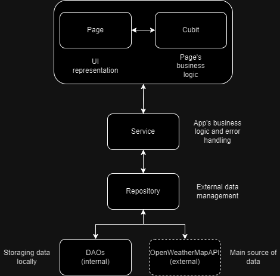

# RockNClouds

## Docs

App libraries: 
1. get_it: ^7.7.0 -> Dependecy injection
2. result_dart: ^1.1.1 -> Result tracking
3. weather: ^3.1.1 -> Consuming data from external API
4. geolocator: ^12.0.0 -> Getting current location
5. connectivity_plus: ^6.0.3 -> Verifying connectivity
6. hive_flutter: ^1.1.0 -> Database 
7. intl: ^0.19.0 -> DateTime formatting
9. string_normalizer: ^0.3.1 -> Removing diatrics from text

### Architecture
The app uses the following architecture.
The main focus is abstract complexity and separate funcitonality

### App's features
The app is offline-first, that means all the data request is firstly fetched from the external API, then storaged in the local database, then returned to the user. 
This offline-first approach is useful for the assurance that the data shown to the user is always locally storaged 

There's 3 pages:
    1. Next shows -> Showing the weather for the incoming concerts and allowing the user to search for one of these cities previously defined
    2. Search -> Showing the weather for the current location and allowing the user to search for any city and mark the city as favorite 
    3. Favorites -> Showing the weather for the cities marked as favorites before

